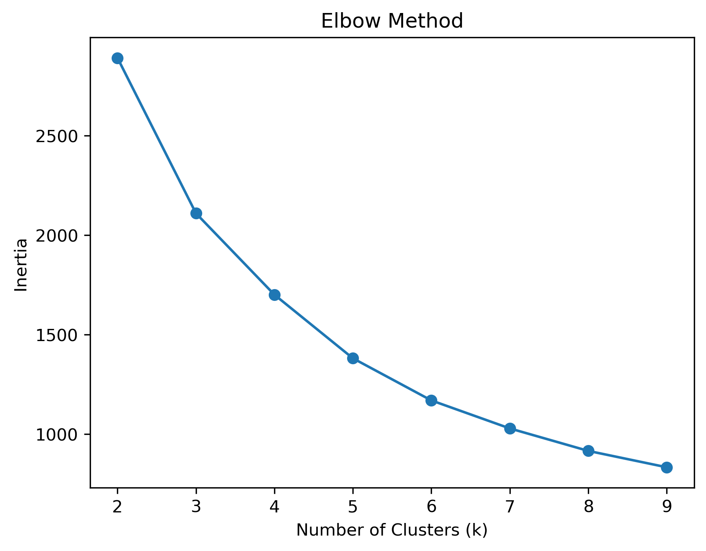
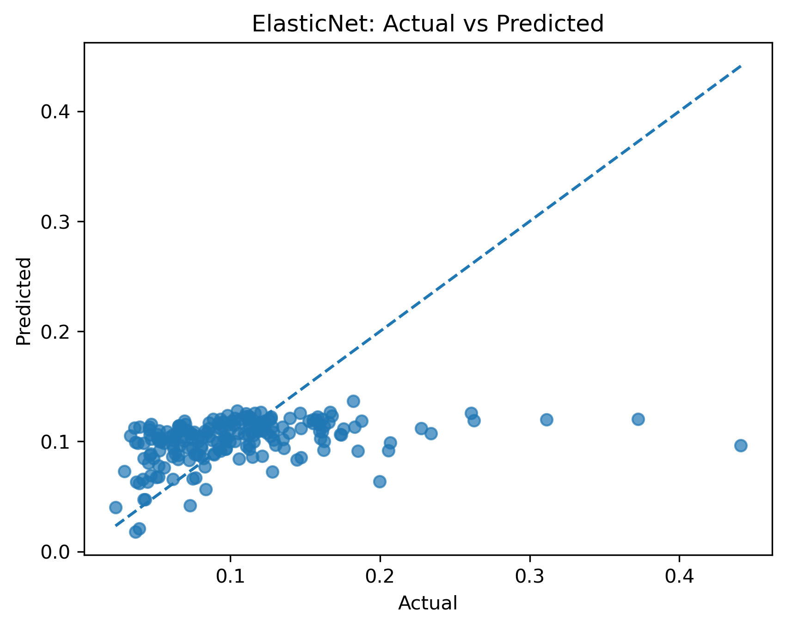
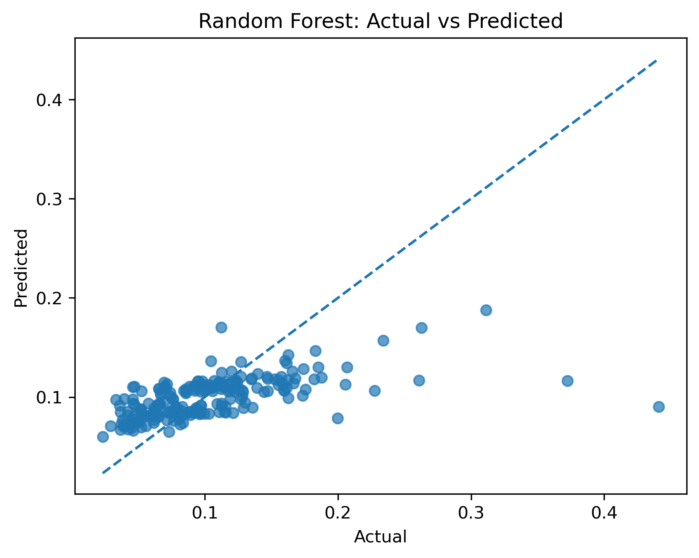
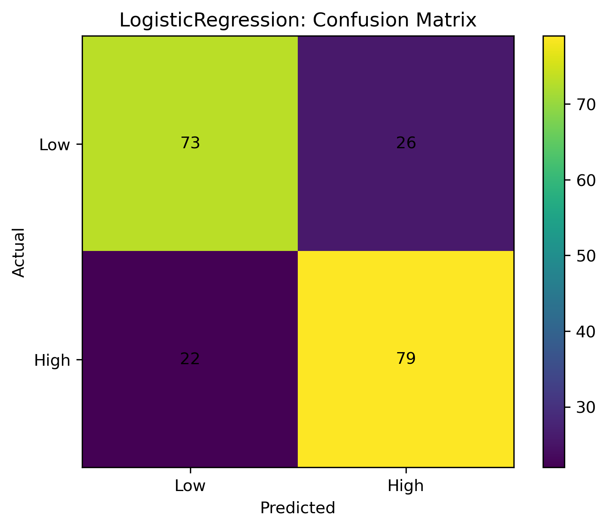
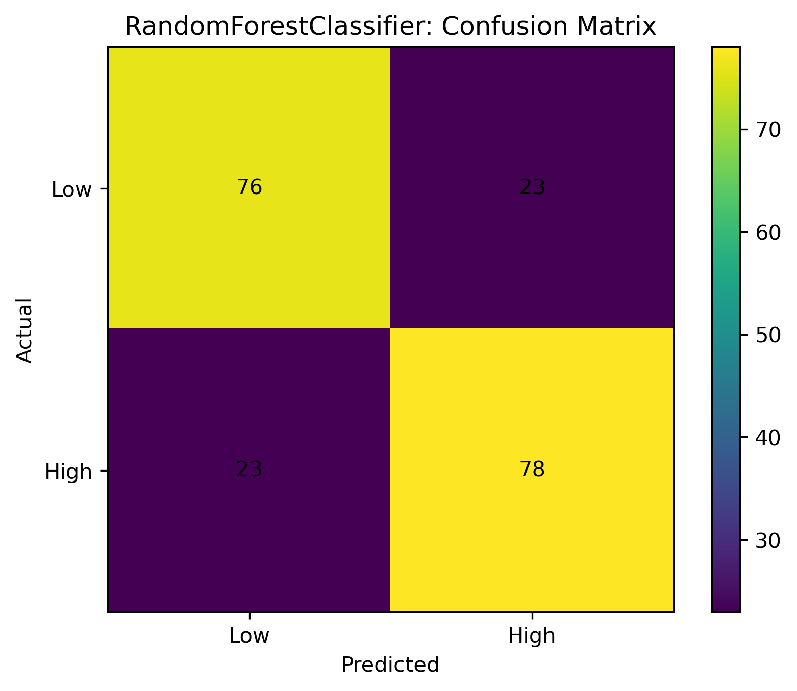
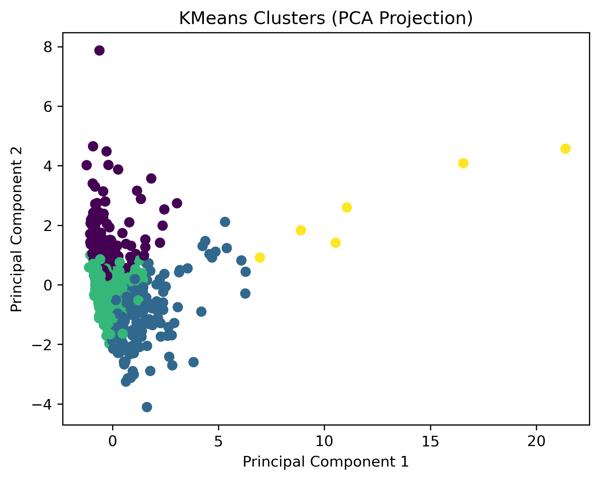

### Introduction / Background
Health insurance coverage is a critical determinant of healthcare access, preventive service utilization, and long-term health outcomes in the United States. Counties with high uninsured rates often experience poorer health outcomes, increased emergency room utilization, and greater financial strain on public health systems. Prior research has demonstrated strong associations between insurance coverage and both mortality and access to care [1], while socioeconomic determinants such as income, employment, and education significantly influence coverage disparities [2]. Additionally, geographic disparities in healthcare access remain persistent despite federal policy efforts such as the Affordable Care Act (ACA) [3].

This project leverages county-level data from Data Commons, a publicly accessible knowledge graph aggregating U.S. Census, CDC, and other federal data sources. The primary dataset explores “Which counties in the US have the highest rates of uninsured?”

Dataset link: [Data Commons – Uninsured Rates by County](https://datacommons.org/explore#client=ui_landing&q=Which+counties+in+the+US+have+the+highest+rates+of+uninsured)

The dataset provides county-level measures of health insurance coverage and its socioeconomic, demographic, and structural determinants. Specifically, the dataset captures:

Insurance Coverage Metrics: Total uninsured rate and coverage breakdowns by age group.

Demographic Composition: Population size, age distribution, racial and ethnic composition, and gender distribution.

Socioeconomic Indicators: Median household income, poverty rate, unemployment rate, labor force participation, and educational attainment levels.

Health and Access Proxies: Indicators related to healthcare access.

Geographic and Structural Characteristics: Urban–rural classification, regional location, and population density.

These features enable both descriptive and predictive modeling of uninsured rates across U.S. counties. Because the dataset integrates socioeconomic and demographic indicators, it is well-suited for supervised and unsupervised machine learning approaches to uncover structural patterns and predictive relationships.

Existing literature has primarily focused on national or state-level trends [1][3], with fewer predictive modeling studies at the county level. Machine learning offers an opportunity to move beyond correlation toward identifying nonlinear relationships and clustering counties with similar risk profiles.

### Problem Definition
**Problem:**

Can we use county-level socioeconomic and demographic features to predict and identify high-risk counties with elevated uninsured rates, and uncover structural clusters of counties with similar insurance vulnerability profiles?

We aim to predict uninsured rate as a continuous variable, classify counties into high-risk vs. low-risk categories, and identify latent clusters of counties with similar socioeconomic patterns.

### Motivation:

Healthcare access inequities remain a pressing national concern. Counties with persistently high uninsured rates often overlap with economically disadvantaged or rural regions. However, policymakers typically rely on descriptive statistics rather than predictive tools.

A machine learning framework could enable early identification of at-risk counties, support data-driven policy allocation of healthcare resources, and reveal nonlinear interactions between poverty, employment, education, and insurance coverage.

Beyond predictive performance, this project contributes to sustainability and ethical governance by promoting equitable healthcare access.

### 3. Methods

#### Data Processing:

We collected county-level socioeconomic indicators from Data Commons, including total population, number of uninsured households, median household income, and unemployment rate. From these variables, we constructed a target variable, `UninsuredRate`, defined as the ratio of uninsured households to total population. Rows with missing target values were removed, while remaining feature-level missing values were handled through preprocessing pipelines to preserve as much data as possible.

To prevent data leakage, the dataset was split into training (80%) and testing (20%) sets prior to preprocessing. Feature preprocessing was performed using a pipeline-based approach. Numerical features were imputed using the median to handle missing values and then standardized using z-score normalization (`StandardScaler`) to ensure consistent feature scaling. Categorical features, when present, were imputed using the most frequent value and encoded using one-hot encoding. A `ColumnTransformer` was used to apply these transformations in parallel, ensuring a clean, reproducible, and leakage-resistant preprocessing workflow.

Additional engineered features, including log-transformed income, log-transformed population density, bachelor-degree rate, and an economic distress index, were created to better capture nonlinear socioeconomic relationships.

#### Model and Implementation:

To address the problem of predicting uninsured rates and identifying high-risk counties, we implemented both supervised and unsupervised learning approaches.

**ElasticNetCV (Baseline Regression)**

As a baseline regression model, we implemented ElasticNetCV. ElasticNet was selected because it provides a balance between feature selection and coefficient shrinkage, helping mitigate overfitting while maintaining interpretability. Additionally, ElasticNetCV performs internal cross-validation to automatically tune hyperparameters such as regularization strength, reducing the need for manual tuning.

The model was integrated into a unified preprocessing pipeline, ensuring transformations were applied consistently during both training and evaluation. Model performance was evaluated using Mean Absolute Error (MAE), Root Mean Squared Error (RMSE), and R².

This approach established a strong and interpretable linear baseline while maintaining robustness against overfitting. Although ElasticNet is limited in capturing complex nonlinear relationships, it provides an important benchmark against which more advanced models can be compared.

**Random Forest Regressor**

To capture nonlinear relationships and interactions between socioeconomic variables, `RandomForestRegressor` was implemented. Unlike ElasticNet, Random Forest does not assume linear relationships and can model more complex dependencies between features such as income, population density, unemployment, and age.

We constrained hyperparameters such as tree depth and minimum samples per leaf to reduce overfitting and improve generalization. Random Forest Regression served as a nonlinear benchmark, allowing us to evaluate whether increased model flexibility improved predictive performance and better captured variation in uninsured rates.

**Logistic Regression**

Logistic Regression was used as a baseline classification model due to its interpretability and efficiency. The model predicts the probability of a county being classified as high-risk using a linear decision boundary, making it well-suited for understanding how socioeconomic variables contribute to classification outcomes.

Logistic Regression provides clear insight into feature importance and directionality, which is valuable for policy-focused applications where interpretability is critical. It serves as a baseline classifier, allowing comparison against more flexible nonlinear models.

**Random Forest Classifier**

To capture nonlinear decision boundaries and feature interactions, `RandomForestClassifier` was implemented. Unlike Logistic Regression, this model can learn more complex relationships between socioeconomic variables and county-level uninsured risk.

The ensemble nature of Random Forest allows it to handle feature interactions and variability in the data more effectively. It serves as a nonlinear classification benchmark, enabling comparison against Logistic Regression to determine whether increased model complexity improves classification performance.

**KMeans Clustering (Unsupervised Learning)**

In addition to predictive modeling, we applied KMeans clustering to identify groups of counties with similar geographic and socioeconomic characteristics. This unsupervised approach enables discovery of latent structural patterns that may not be fully captured by supervised learning models.

The number of clusters (`k = 4`) was selected using the elbow method. Principal Component Analysis (PCA) was additionally used for dimensionality reduction and visualization. KMeans complements the regression and classification models by helping explain why certain counties exhibit similar insurance-vulnerability profiles, rather than only predicting outcomes.

#### Evaluation Pipeline

Model evaluation was centralized through a unified metrics pipeline that performed holdout evaluation, 5-fold cross-validation, and automated visualization generation for regression, classification, and clustering workflows. This ensured consistent evaluation procedures across all models while improving reproducibility and comparability.

#### Rationale

This combination of models and preprocessing techniques allowed us to approach the problem from multiple perspectives while maintaining proper data preparation and evaluation practices. ElasticNet provided an interpretable linear baseline, while Random Forest Regression captured nonlinear interactions and more complex feature relationships. Classification models, including Logistic Regression and Random Forest Classifier, provided a decision-oriented perspective by identifying counties at high risk for elevated uninsured rates. This enables more actionable insights for resource allocation and policy intervention.

KMeans clustering revealed broader structural groupings and socioeconomic patterns across counties. Together, these approaches support both prediction (estimating uninsured risk) and interpretation (understanding why patterns exist), aligning closely with the project goal of identifying high-risk counties and uncovering underlying structural disparities.

### 4. Results and Discussion

#### Regression Performance and Results 

The core goal of our regression task was to predict county-level uninsured rates. Regression models were evaluated using Mean Absolute Error (MAE), Root Mean Squared Error (RMSE), and R² on both holdout and cross-validation sets. Model behavior was additionally visualized using actual vs. predicted plots.

| Metric      | ElasticNet Holdout  | RandomForest Holdout | ElasticNet CV | RandomForest CV |
| ------------| ------------------- | -------------------- | ------------- | ---------------- |
| MAE         | 0.036               | 0.031                | 0.034 +/- 0.008 | 0.033 +/- 0.008 |
| RMSE        | 0.053               | 0.048                | 0.044 +/- 0.011 | 0.044 +/- 0.011 |         
| R²          | 0.135               | 0.299                | 0.150 +/- 0.166 | 0.167 +/- 0.160 | 

| Set     | ElasticNet Visualization                           | RandomForest Regression Visualization                            |
|---------|----------------------------------------------------|------------------------------------------------------------------|
| Holdout |               |             |
| CV      |  |  |

Random Forest achieved stronger regression performance overall, producing lower prediction error and substantially higher R² values than ElasticNet. The higher R² indicates that Random Forest better captures overall variation in uninsured rates by modeling nonlinear socioeconomic relationships. Cross-validation results for both models were relatively stable, suggesting reasonable generalization performance despite the inherent difficulty of predicting exact uninsured rates. 

These results highlight the tradeoff between interpretability and flexibility. ElasticNet provides a stable and interpretable linear baseline, while Random Forest captures more complex feature interactions and nonlinear dependencies. Although Random Forest improved predictive performance, both models still struggled to fully capture extreme uninsured counties, indicating limitations in the available feature representation and the complexity of the underlying socioeconomic patterns.

#### Interpretation of Regression Results

The actual vs. predicted plots show a positive relationship for both models, indicating that both capture general trends in uninsured rates. However, both models exhibit prediction compression toward the mean, with predictions concentrated within a narrower range than the true values. In particular, both models consistently underpredict counties with extremely high uninsured rates, as shown by points falling below the diagonal at larger target values. This suggests that the models have difficulty capturing rare or structurally distinct counties with unusually high uninsured populations.

ElasticNet provides interpretable coefficients that help explain these relationships. Median Household Income (-0.023) and Unemployment Rate (-0.005) emerged as the strongest predictors of uninsured rates. Higher-income counties generally exhibited lower uninsured rates, likely reflecting greater access to employer-sponsored insurance and healthcare resources.

Random Forest feature importances reinforce these findings while capturing additional nonlinear structure. Median Household Income remained the strongest predictor, followed by Median Age and Unemployment Rate. These results suggest that counties with lower income, older populations, and greater economic distress are more likely to experience elevated uninsured rates. Together, the regression models consistently identify income and unemployment as the dominant drivers of county-level insurance vulnerability.

---

### Classification Performance and Results

To complement regression, we also evaluated the binary classification task of labeling counties as high-risk if their uninsured rate exceeded the median threshold (0.0937).

| Metric      | LogisticRegression Holdout  | RandomForestClassifier Holdout | LogisticRegression CV | RandomForestClassifier CV |
| ------------| --------------------------- | ------------------------------ | --------------------- | ------------------------- |
| Accuracy    | 0.760                       | 0.770                          | 0.809 +/- 0.012       | 0.780 +/- 0.026           |
| Precision   | 0.752                       | 0.772                          | 0.820 +/- 0.039       | 0.771 +/- 0.051           |    
| Recall      | 0.782                       | 0.772                          | 0.799 +/- 0.043       | 0.808 +/- 0.031           | 
| F1          | 0.767                       | 0.772                          | 0.808 +/- 0.010       | 0.787 +/- 0.018           |
| ROC-AUC     | 0.870                       | 0.849                          | 0.898 +/- 0.012       | 0.873 +/- 0.016           |

| Logistic Regression Confusion Matrix                  | RandomForest Classification Confusion Matrix                           |
|-------------------------------------------------------|------------------------------------------------------------------------|
|   |  |

Both classification models achieved strong performance, with Logistic Regression slightly outperforming Random Forest in cross-validation ROC-AUC and overall balance. Confusion matrices show that both models successfully identify high-risk counties with relatively balanced precision and recall, indicating that the models are not strongly biased toward either class.

Interestingly, Logistic Regression performed comparably to or better than Random Forest despite its simpler linear structure. This suggests that socioeconomic features provide a relatively linearly separable signal for identifying high-risk counties, and that additional model complexity does not substantially improve classification performance.

#### Interpretation of Classification Results

The classification results demonstrate that socioeconomic indicators provide meaningful predictive signal for identifying high-risk uninsured counties. The balanced precision and recall values indicate that the models effectively identify both high-risk and lower-risk counties without heavily favoring one class over the other. Additionally, the relatively consistent cross-validation performance suggests stable generalization across different train-test splits.

Logistic Regression coefficients again identified Median Household Income and Unemployment Rate as the strongest predictors. Higher income was associated with lower uninsured risk, while greater unemployment increased the probability of a county being classified as high-risk.

Random Forest Classifier feature importances reinforced these findings while additionally emphasizing demographic structure through Median Age. Together, the classification models consistently demonstrate that income, unemployment, and demographic characteristics are central drivers of county-level insurance vulnerability.

Importantly, classification performance was substantially stronger than regression performance overall. This suggests that identifying whether a county belongs to a high-risk category is more tractable than precisely predicting its exact uninsured rate, making classification a potentially more practical framework for policy-oriented intervention targeting.

---

### Clustering Results and Interpretation

KMeans clustering (`k = 4`) was used to identify groups of counties with similar socioeconomic characteristics. Clustering evaluation produced a Silhouette Score of 0.325, Calinski-Harabasz Score of 444.94, and Davies-Bouldin Score of 0.96. These results indicate moderate cluster separation with reasonably distinct county groupings despite overlap between some socioeconomic profiles.

| Cluster | Uninsured Rate | Avg. Population | Avg. Uninsured Households | Median Income | Unemployment | Risk |
| ------- |----------------| ----------------| ------------------------- | -------------- | ------------- | ---- |
| 0       | 6.85%          | 711K            | 51K                       | $106K          | 4.31%         | Low |
| 1       | 10.35%         | 165K            | 14K                       | $72K           | 4.06%         | Moderate |
| 2       | 13.90%         | 4.97M           | 617K                      | $80K           | 4.86%         | High |
| 3       | 11.50%         | 181K            | 17K                       | $61K           | 6.01%         | High |

Visualization of clusters using PCA shows that some county groups are tightly concentrated while others are more dispersed, indicating varying levels of structural similarity across counties. Cluster-level statistics reveal meaningful differentiation between county groups.

Cluster 0 represents affluent suburban or economically stable counties with high income and the lowest uninsured rates. Cluster 1 contains moderate-risk counties with mid-sized populations and below-average income levels. Cluster 2 contains the largest urban counties with the highest uninsured rates, likely reflecting concentrated poverty, population scale, and labor-market complexity. Cluster 3 represents economically distressed smaller counties with high unemployment and elevated uninsured rates.

Overall, clustering reveals that uninsured rates are driven by distinct combinations of income, unemployment, and population structure. These clusters provide additional structural insight beyond supervised prediction alone and help explain why certain counties consistently exhibit elevated uninsured risk.

---

### Model Comparison

- **ElasticNet:** interpretable linear baseline with stable predictions but limited ability to capture nonlinear relationships. Primarily driven by income and unemployment variables.
- **Random Forest Regression:** captures nonlinear relationships and improves overall predictive performance, particularly R², but still struggles with extreme uninsured counties.
- **Logistic Regression:** strongest overall classification model with high ROC-AUC and strong generalization performance. Effective for identifying high-risk counties while remaining interpretable.
- **Random Forest Classifier:** captures nonlinear decision boundaries and performs competitively with Logistic Regression, though without substantial improvement.
- **KMeans Clustering:** reveals structural groupings of counties based on population scale and socioeconomic characteristics, providing broader contextual understanding of uninsured risk.

Together, these models provide a comprehensive framework combining prediction, classification, and structural pattern discovery.

---

### Key Insights

Socioeconomic indicators can successfully identify counties at elevated risk for high uninsured rates, though exact uninsured-rate prediction remains more difficult. Across all supervised models, Median Household Income and Unemployment Rate consistently emerged as the strongest predictors of insurance vulnerability. Classification models substantially outperformed regression models overall, suggesting that identifying high-risk counties is more tractable than precisely estimating uninsured rates. 

Clustering further revealed that counties naturally group into structurally distinct socioeconomic profiles characterized by differences in income, unemployment, population scale, and demographic composition. Together, these results demonstrate that machine learning can effectively uncover meaningful patterns in insurance vulnerability while providing actionable insights for identifying high-risk counties and understanding broader structural disparities.
